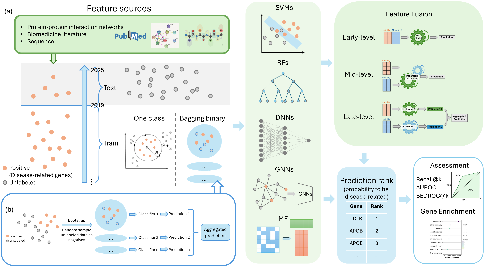

# Gene Benchmark

## Overview
End-to-end disease–gene association benchmarking pipeline

This repository provides a unified and reproducible evaluation framework for gene prioritization (GP). The framework adopts time-based data splitting and ranking-aware evaluation metrics to better reflect realistic disease gene discovery scenarios. It focuses on fair benchmarking and systematic comparison of feature representations, base learning algorithms, and prediction integration strategies.

## Structure
- `src/gene_benchmark/config.py` — single source of truth for defaults.
- `src/gene_benchmark/features.py` — feature loaders.
- `src/gene_benchmark/data_io.py` — DGA/edge loaders.
- `src/gene_benchmark/metrics.py`, `kernels.py` — shared utilities.
- `src/gene_benchmark/models/` — model implementations.
- `src/gene_benchmark/pipelines/` — pipeline entry points.
- `src/gene_benchmark/pipeline.py` — orchestrates full workflow.
- `notebooks/run_all.ipynb` — high-level notebook runner.

## Quickstart
```bash
cd /itf-fi-ml/shared/users/ziyuzh/gene_benchmark
python -m pip install -e .
```

### Run programmatically
```python
from gene_benchmark.config import default_config
from gene_benchmark.pipeline import run_all

cfg = default_config()
run_all(cfg)
```

### Notebook
Open `notebooks/run_all.ipynb` and run all cells.

## Notes
- Paths assume data already present under `data/`.
- Results are written to `results/` with subfolders per pipeline.

## Migration guide
- Old scripts `main_*.py` now live inside the package and read defaults from `config.py`.
- Hard-coded `dga/time/time_split` removed; use `Config` instead.
- Shared utilities moved to `metrics.py` / `kernels.py` to reduce duplication.

## Technical debt / TODO
- Further deduplicate metric helpers inside model files.
- Add tests and lightweight smoke runs instead of full training in CI.
